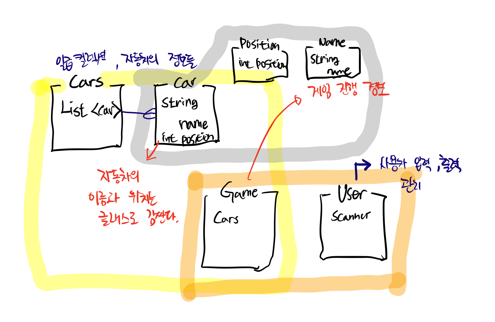

# 자동차 경주 게임
## 진행 방법
* 숫자 야구 게임 요구사항을 파악한다.
* 요구사항에 대한 구현을 완료한 후 자신의 github 아이디에 해당하는 브랜치에 Pull Request(이하 PR)를 통해 과제를 제출한다.

## 과제 제출 과정
* [과제 제출 방법](https://github.com/next-step/nextstep-docs/tree/master/precourse)

## 구현 기능 목록
모든 구현은 테스트케이스 작성을 먼저 하여 TDD를 진행하는 것을 원칙으로 한다.

* 컴마를 구분자로 n대의 차가 생성되는지 확인한다.
  * Name 클래스를 생성한다.
  * 자동자의 이름을 체크하는 로직을 개발한다.
  * Positive 클래스를 생성하고 음수값 체크 로직을 테스트한다.
    

* User에게 입력을 받아 자동차가 잘 생성 되는지 테스트 한다.
  

* 일급 콜렉션의 Cars에 Car가 제대로 생성 되는지 체크한다.
* 자동차의 이동을 랜덤으로 정하는 기능을 구현한다.
* 자동차의 이동 횟수를 받는 기능 구현을 한다.
* 자동차의 랜덤 값을 토대로 전진과 멈춤 기능을 구현한다.
* 자동차 경주의 완료 기능을 개발한다.

* 게임 진행 플로우를 단순화 하기 위한 리팩토링을 진행한다.